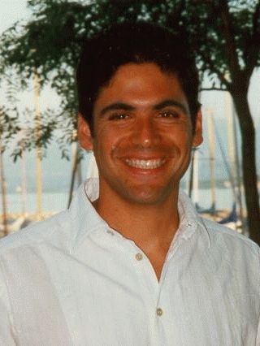

# Keynotes

## Rachid Guerraoui

[Rachid Guerraoui](https://people.epfl.ch/rachid.guerraoui?lang=en) has been affiliated with Ecole des Mines of Paris, the Commissariat à l'Energie Atomique of Saclay, Hewlett Packard Laboratories and the Massachusetts Institute of Technology. He has worked in a variety of aspects of distributed computing, including distributed algorithms and distributed programming languages. He is most well known for his work on (e-)Transactions, epidemic information dissemination and indulgent algorithms. He co-authored a book on Transactional Systems (Hermes) and a book on reliable distributed programming (Springer). He was appointed program chair of ECOOP 1999, ACM Middleware 2001, IEEE SRDS 2002, DISC 2004 and ACM PODC 2010.
Rachid Guerraoui's current projects include secure distributed storage, transactional shared memory and the computability of distributed algorithms. His recent research has been sponsored by the European Commission, the Swiss National Science Foundation, LODH, MSR and HP. 

## KC Sivaramakrishnan

[KC Sivaramakrishnan](https://kcsrk.info/) is an Assistant Professor in the Computer Science and Engineering department at Indian Institute of Technology, Madras and the Chief Technology Officer of Tarides. He is interested in building robust, secure and scalable systems using programming language technology.
He led the development of Multicore OCaml, a concurrent and parallel extension of the OCaml programming language. Multicore OCaml is now merged into OCaml, and is available for general use in OCaml 5.0. Effect handlers introduced as part of the concurrency story of Multicore OCaml has had influence on the design of React Hooks and WebAssembly stack switching.
He has co-founded several companies: Tarides - France;  OCaml Labs Consultancy - UK (joined Tarides); and Segfault Systems - India (joined Tarides),
Earlier, he was a Senior Research Associate under the OCaml Labs initiative at the University of Cambridge Computer Lab, an 1851 Research Fellow and a Research Fellow at Darwin College, Cambridge. Earlier, he was a graduate student at Purdue University where he obtained an MS and a PhD degree in Computer Science under the supervision of Prof. Suresh Jagannathan. Before that, he obtained his BEng degree in Computer Science and Engineering from Anna University, India.

# Program

TBD