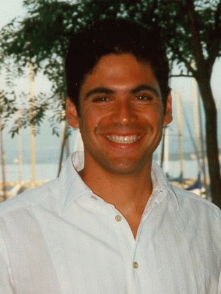
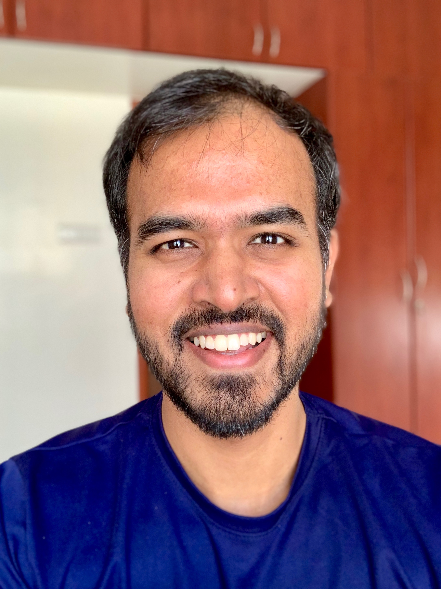

# Workshop Program

* Full-text of the proceedings will be available in the [ACM DL](https://dl.acm.org/doi/proceedings/10.1145/3806077) on the day of the workshop.

## Schedule

**Room:** Carrick 1 (Level 1)

* 8:00am **Registration / Cafe**
* 9:00am **Welcome and chairs report**
* 9:10am **Keynote talk**
    * _Genuine State Machine Replication_,  Rachid Guerraoui (EPFL)
* 10:10am **Session 1**
    * 10:10am [_Data Consistency Challenges in AI Applications_](https://www.cs.cornell.edu/projects/Quicksilver/public_pdfs/Data_Consistency_Challenges_in_AI_Systems_and_Machine_Learning_Services.pdf) (long paper), Ken Birman (Cornell University and Microsoft), Jamal Aziz Hashim (Cornell University), Edward Tremel (Augusta University), Alicia Yang (Cornell University)
* 10:30am **Break**
* 11:00am **Session 2**
    * 11:00am [_ERA: Epoch-Resolved Arbitration for Duelling Admins in Group Management CRDTs_](https://doi.org/10.1145/3806077.3806691) (short paper), Kegan Dougal (Element Creations Ltd)
    * 11:20am [_Towards Distributed Constraint Solving with CRDT_](https://doi.org/10.1145/3806077.3806699) (short paper), Hakan Hasan (SnT, University of Luxembourg), Pierre Talbot (University of Luxembourg)
    * 11:40am [_Sal: Multi-modal Verification of Replicated Data Types_](https://arxiv.org/abs/2603.27202) (short paper), Pranav Ramesh (Indian Institute of Technology, Madras), Vimala Soundarapandian (Indian Institute of Technology, Madras), KC Sivaramakrishnan (Indian Institute of Technology, Madras)
    * 12:00pm [_Can you keep a secret? A new protocol for sender-side enforcement of causal message delivery_](https://arxiv.org/abs/2603.14690) (long paper), Yan Tong (UC Santa Cruz), Nathan Liittschwager (UC Santa Cruz), Lindsey Kuper (UC Santa Cruz)
    * 12:20pm _It’s not a lie if you don’t get caught: simplifying reconfiguration in SMR through dirty logs_ (lightning talk), Natacha Crooks (UC Berkeley & Subzero Labs), Allen Clement (Subzero Labs), Neil Giridharan (UC Berkeley & Subzero Labs), Alex Shamis (Subzero Labs)
* 12:30pm **Lunch**
* 2:00pm **Keynote talk**
    * _From Convergence to Confidence: Push-Button Verification for Replicated Data Types_, KC Sivaramakrishnan (IIT Madras)
* 3:00pm **Session 3**
    * 3:00pm [_Bounding Byzantine Impact in Open CRDT Systems_](https://doi.org/10.1145/3806077.3806698) (short paper), Carlos Baquero (Universidade do Porto & INESC TEC), Francisco Maia (Universidade do Porto & INESC TEC), Abel Dantas (Universidade do Porto & INESC TEC), Antonio Fernandez Anta (IMDEA Software Institute & IMDEA Networks Institute), Davide Frey (Inria), Cesar Sanchez (IMDEA Software Institute), Timothé Albouy (IMDEA Software Institute)
    * 3:20pm _Towards practical DAG-based BFT SMR_ (lightning talk), Paul Bergmann (Friedrich-Alexander-Universität Erlangen-Nürnberg)
* 3:30pm **Break**
* 4:00pm **Session 4**
    * 4:00pm [_Semantic Conflict Model for Collaborative Data Structures_](https://doi.org/10.1145/3806077.3806700) (short paper), Georgii Semenov (ITMO University), Vitaly Aksenov (ITMO University)
    * 4:20pm [_ConflictSync: Bandwidth Efficient Synchronization of Divergent State_](https://doi.org/10.1145/3806077.3806697) (short paper), Carlos Baquero (Universidade do Porto & INESC TEC), Pedro Gomes (Universidade do Porto), Miguel Boaventura Rodrigues (Universidade do Porto)
    * 4:40pm [_AegisSheet: A Compositional CRDT for Collaborative Spreadsheets_](https://doi.org/10.1145/3806077.3806695) (short paper), Florian Pfeil (Technische Universität Darmstadt), David Scandurra (Technische Universität Darmstadt), Julian Haas (Technische Universität Darmstadt)
    * 5:00pm [_CobbleDB: Modelling Levelled Storage by Composition_](https://doi.org/10.1145/3806077.3806696) (short paper), Emilie Ma (University of British Columbia), Ayush Pandey (Télécom SudParis), Annette Bieniusa (University of Kaiserslautern-Landau (RPTU), Marc Shapiro (Sorbonne-Université–LIP6 & Inria)
    * 5:20pm _A Starting Point Towards Accessible Formal Verification of Local-First Access Control_ (lightning talk), Florian Jacob (Karlsruhe Institute of Technology (KIT), Johanna Stuber (Karlsruhe Institute of Technology (KIT), Hannes Hartenstein (Karlsruhe Institute of Technology (KIT)
* 5:30pm **Welcome reception**

## Keynotes

### Genuine State Machine Replication

[Rachid Guerraoui](https://people.epfl.ch/rachid.guerraoui?lang=en) has been affiliated with Ecole des Mines of Paris, the Commissariat à l'Energie Atomique of Saclay, Hewlett Packard Laboratories and the Massachusetts Institute of Technology. He has worked in a variety of aspects of distributed computing, including distributed algorithms and distributed programming languages. He is most well known for his work on (e-)Transactions, epidemic information dissemination and indulgent algorithms. He co-authored a book on Transactional Systems (Hermes) and a book on reliable distributed programming (Springer). He was appointed program chair of ECOOP 1999, ACM Middleware 2001, IEEE SRDS 2002, DISC 2004 and ACM PODC 2010.
Rachid Guerraoui's current projects include secure distributed storage, transactional shared memory and the computability of distributed algorithms. His recent research has been sponsored by the European Commission, the Swiss National Science Foundation, LODH, MSR and HP.

### From Convergence to Confidence: Push-Button Verification for Replicated Data Types

**Abstract** _Replicated Data Types (RDTs) underpin a growing class of geo-distributed applications, but what it means for an RDT to be correct, and how to prove it, remains surprisingly subtle. Strong eventual consistency guarantees only that replicas eventually agree; replication-aware linearizability further requires that whatever state they agree on is reachable by linearising the updates each replica has actually observed. A compelling specification, but one that has historically demanded painstaking, hand-written proofs. In this talk, I will trace a multi-year arc aimed at replacing those proofs with push-button verification for Mergeable Replicated Data Types (MRDTs). Automated proof assistants and, more recently, agentic proof-oriented programming are steadily eroding the need for manual scaffolding. The story, I hope, illustrates something broader: that the gap between "we believe this merges correctly" and "we have proved it merges correctly" is narrowing to the point where correct-by-construction replicated data is becoming a realistic engineering proposition rather than a research aspiration._

[KC Sivaramakrishnan](https://kcsrk.info/) is an Assistant Professor in the Computer Science and Engineering department at Indian Institute of Technology, Madras and the Chief Technology Officer of Tarides. He is interested in building robust, secure and scalable systems using programming language technology.
He led the development of Multicore OCaml, a concurrent and parallel extension of the OCaml programming language. Multicore OCaml is now merged into OCaml, and is available for general use in OCaml 5.0. Effect handlers introduced as part of the concurrency story of Multicore OCaml has had influence on the design of React Hooks and WebAssembly stack switching.
He has co-founded several companies: Tarides - France;  OCaml Labs Consultancy - UK (joined Tarides); and Segfault Systems - India (joined Tarides),
Earlier, he was a Senior Research Associate under the OCaml Labs initiative at the University of Cambridge Computer Lab, an 1851 Research Fellow and a Research Fellow at Darwin College, Cambridge. Earlier, he was a graduate student at Purdue University where he obtained an MS and a PhD degree in Computer Science under the supervision of Prof. Suresh Jagannathan. Before that, he obtained his BEng degree in Computer Science and Engineering from Anna University, India.

